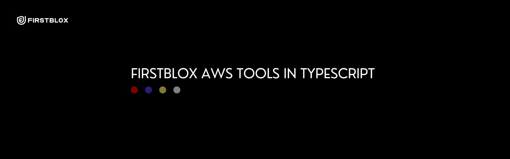
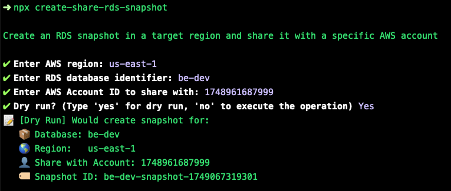
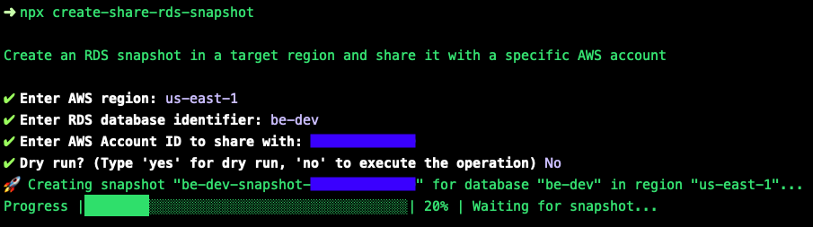

firstblox AWS tools - TypeScript
---------------------------------

# Table of Contents

[Overview](#overview)

[Install](#install)

[Development](#development)

[Execution](#execution)

# Overview



**Whats included?**

- Projen TS project scaffolding.
- Commander for script description and options
- Inquirer for input propmpts
- CLI feedback for command line loader feedback

**Pre-requisites**

- Node/TS installed.
- Projen installed.
- AWS account credentials

# Install

## Package installation

**If you have been granted access to the packaged version you can install as per the below command.**

```bash
npm install @firstblox/firstblox-aws-tools-ts
```

## Initial installation

**To begin development follow the below installation guidelines**

Ensure pnpm is installed.

```bash
npm install -g pnpm
```

**Install dependencies.**

```bash
pnpm i
```

## Adding dependencies

Any new dependencies must be added to `.projenrc` at the root of the project.

## Using Projen

Once the initial installation of dependencies complete, in order to keep all project configuration files and dependencies in sync, each time `.projenrc` is updated run the following command.

```
npx projen
```

# Development

## Projen

To configure the project and project dependencies please modify `.projenrc` ONLY.

A good rule of thumb:

- Utilise projenrc in all cases where projen supports a configuration action/type.
- Apply a manual addition/change in cases where projen does not support a configuration action/type or it cannot be customised through projen.

Once configuration changes are made via `.projenrc` run the below command.

```bash
npx projen
```

## Adding new scripts

Add new scripts to [./src/bin/scripts](./src/bin/scripts/).

## Build

```bash
npx projen build
```

# Execution

## AWS Credentials

Setup aws credentials for your target AWS account using your preferred method.

## Available script(s)

See available scripts [package.json](./package.json).

### Create RDS Snapshots

```bash
npm run create-share-rds-snapshot
```

**Create and Share RDS Snapshot output - DRY RUN**



**Create and Share RDS Snapshot output**

